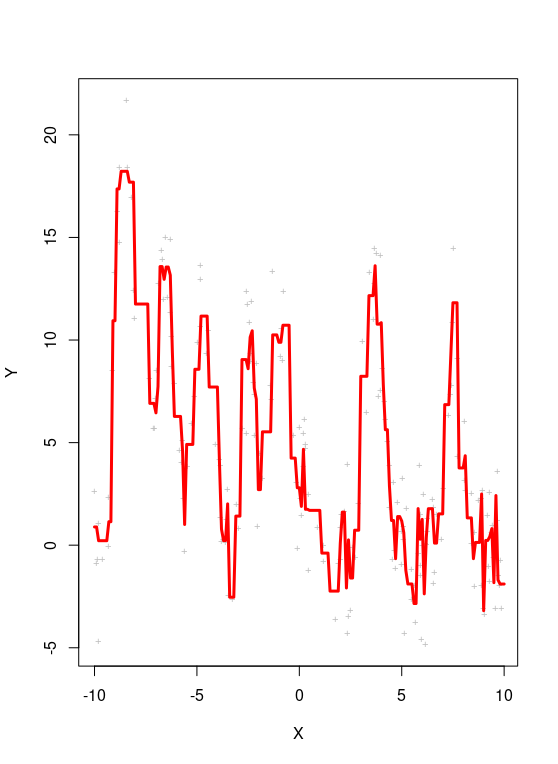

---
title: 'Problem Set #1'
author: "Tiantian Meng, Caiwei Wang"
date: "`r Sys.Date()`"
output:
  pdf_document:
    toc: no
    toc_depth: '2'
  html_document:
    toc: no
    toc_depth: '2'
    df_print: paged
  prettydoc::html_pretty:
    df_print: kable
    theme: leonids
    highlight: github
    toc: no
    toc_depth: 2
    toc_float:
      collapsed: no
urlcolor: blue
---

```{r, include=FALSE}
library(ggplot2)
library(data.table)
library(dplyr)
knitr::opts_chunk$set(echo = TRUE, message=FALSE, warning = FALSE, fig.width = 16/2, fig.height = 9/2, tidy.opts=list(width.cutoff=60), tidy=TRUE)
```

This is the first problem set for QTM 347.  It contains a programming problem that is intended to introduce you to the type of scientific programming that we will be doing in this class.  You may complete this problem set in groups of up to 3.  Be sure to indicate any collaborators at the top of your solutions document.  All students must turn in a copy of the solutions.  

Please use the intro to RMarkdown posted in the Intro module and my .Rmd file as a guide for writing up your answers.  You can use any language you want.

Your final submission on Canvas should include, at a minimum, 2 files: 1) a .Rmd/.ipynb file and 2) either a rendered HTML file or a PDF.

This assignment is due by January 20th, 2023 at 11:59 PM EST. 

# Problem 1 (100 points)

This class is largely about **approximating functions** - given a set of covariates, $\{\mathbf{x}_i\}_{i = 1}^N$, and outcomes, $\{y_i\}_{i = 1}^N$, estimate a function such that $\hat{f}(x_i) \approx y_i$ for all observations.  Unlike your previous classes, we're not only concerned with estimating this function such that the observations we received are well approximated - we also want to ensure that **any sets of covariate/outcome pairs we could potentially see in the future** are also well approximated using $\hat{f}(\mathbf x_i)$.  This additional caveat adds a delicate balance between choosing functions that fit the data we observe (the training data) and functions that are likely to do well on additional observations!


## Part 1 (10 pts.)

Load in the data set contained in `PS1Train1.csv`.

The training data contains a deceivingly simple data set - a single input value, `x`, and a single output, `y`.  The true function that maps `x` to `y` is a complicated mixture of normal distributions with some random noise added at the end.

Create a plot for the training data that shows the input plotted against the output.  Be sure to label the axes!  Does this look like any function - $\hat{f}(x_i) = y_i$ - that you've ever seen before?

### Part 1 Solution
```{r}
# Load the data
train1 <- read.csv("PS1Train1.csv", header = T)
head(train1)

# Plot:
plot(train1$x, train1$y,
     xlab = "x",
     ylab = "y",
     main = "x vs y")

```
I thought it doesn't look like any function I've ever seen, the dots are spread out.


## Part 2 (15 pts.)

Use OLS to estimate a regression function that relates `x` to `y` for the data set. Compute the mean squared error of the fit: 

$$\text{MSE}(x,y) = \frac{1}{N}\sum \limits_{i = 1}^N (y_i - \hat{y}_i)^2$$

Similarly, create a plot for the data set that plots `x`, `y`, and the corresponding regression line.  Is a univariate linear regression model the best approach to approximating the data generating function?

### Part 2 Solution
```{r}
train1.lm = lm(y ~ x, data = train1) 
summary(train1.lm)

#MSE:
residTrain1 <- resid(train1.lm)
SSE <- sum(residTrain1^2)
MSE <- SSE/200
MSE
```

```{r}
# Plot:
library(ggplot2)
ggplot(train1,aes(x,y)) +
  geom_point() +
  geom_smooth(method = "lm") +
  labs(title = "")


```
The mean squared error of the fit is 24.04439. Not that fit, even though there are only one independent variable and one dependent variable, but the dots in the plots are spread out, not very closed to the regression line, so there would be other regression model more fitted it.


## Part 3 (25 pts.)

Let's use a "wigglier" method to better approximate the funky relationship between `x` and `y`.  A basic method that achieves this is **polynomial regression**.  Allowing the relationship between `x` and `y` to be modeled by a 3rd order polynomial model would use OLS to estimate the coefficients for the following regression model:

$$y_i = \alpha + \beta_1 x_i + \beta_2 x_i^2 + \beta_3 x_i^3 + \epsilon_i \text{   ;   } \epsilon_i \sim \mathcal{N}(\epsilon_i | 0 , \sigma^2)$$

More generally, a $K^{th}$ order polynomial model:

$$y_i = \alpha + \sum \limits_{k = 1}^K \beta_k x_i^{k} + \epsilon_i$$

For the training set, estimate 1st through 20th order polynomial regression models mapping `x` to `y`.  For each model, compute the MSE of the fit with respect to the training data.  Plot the MSE as a function of the order of the polynomial for both data sets.  What generic trend do you see here?

For the 1st, 3rd, 5th, 10th, 15th, and 20th order polynomial models, plot `x` against `y` and overlay the fitted regression/prediction *curve*.  Combine all of these plots into a single grid figure.  How does the fit change with respect to the observed data as the polynomial degree increases?

Notes:

  1. Don't try to program the polynomial terms by hand!  See `poly()` in `R` or `PolynomialFeatures` in `sklearn` in `Python`.  It'll make your life (and the computational stability of the algorithm) much easier.  These functions rotate the polynomial space to create a series of **orthogonal polynomials** that reduce the correlation between each column of the altered design matrix.  Since we don't really care about the values of the coefficients in this example, we don't need to ensure that the regression coefficients are interpretable as *a one unit change in x results in a $\beta$ unit change in y*.  Therefore, there is no reason to use **raw polynomials**.
  
  2. Combining multiple plots into a single one will help your solutions documents (and any other technical document you may write in the future) look cleaner and more professional.  How you do this depends on the language and plotting software you are using.  In R, you can combine plots created using base R plotting by placing `par(mfrow = c(2,3))` before generating your six plots - more info [here](https://bookdown.org/ndphillips/YaRrr/arranging-plots-with-parmfrow-and-layout.html).  If you are using `ggplot` in R, I recommend using the `cowplot` package to arrange your figures into a $2 \times 3$ grid - more info [here](https://cran.r-project.org/web/packages/cowplot/vignettes/introduction.html).  In Python, `matplotlib` has a natural way to arrange graphs using `subplot` - more info [here](https://www.tutorialspoint.com/how-to-combine-multiple-graphs-in-python).
  
  3. When attempting to estimate the polynomial regression of differing degrees, I **highly** recommend using a for loop to iterate over all of the polynomial degrees.  Read the documentation for the polynomial generator to figure out which argument should be looped over!


### Part 3 Solution

### First Part
```{r}
MSE <- rep(0,20)
order <- c(1:20)

for(i in 1:20){
  model <- lm(y ~ poly(x, i, raw = FALSE), data = train1)
  MSE[i] <- mean(model$residuals^2)
}

plot(order, MSE,
     xlab = "order",
     ylab = "MSE",
     main = "order vs MSE")


```
There is a negative trend here, as the order increases, the MSE would decrease. And there is a gap over there, the last 8 MSEs significent lower then the first 12 MSEs.

### Second Part
```{r}
library(ggplot2)
library(formatR)
library(cowplot)

p1 <- ggplot(train1, aes(x,y)) + 
  geom_point() + 
  stat_smooth(method = "lm",  # Add polynomial regression curve
              formula = y ~ poly(x, 1),
              se = FALSE) +
   labs(title = "1st order")

p3 <- ggplot(train1,aes(x,y)) + 
  geom_point() + 
  stat_smooth(method = "lm",  # Add polynomial regression curve
              formula = y ~ poly(x, 3),
              se = FALSE) + 
  labs(title = "3rd order")

p5 <- ggplot(train1,aes(x,y)) + 
  geom_point() + 
  stat_smooth(method = "lm",  # Add polynomial regression curve
              formula = y ~ poly(x, 5),
              se = FALSE) +
  labs(title = "5th order")

p10 <- ggplot(train1,aes(x,y)) + 
  geom_point() + 
  stat_smooth(method = "lm",  # Add polynomial regression curve
              formula = y ~ poly(x, 10),
              se = FALSE) +
  labs(title = "10th order")

p15 <- ggplot(train1,aes(x,y)) + 
  geom_point() + 
  stat_smooth(method = "lm",  # Add polynomial regression curve
              formula = y ~ poly(x, 15),
              se = FALSE) + 
  labs(title = "15th order")

p20 <- ggplot(train1,aes(x,y)) + 
  geom_point() + 
  stat_smooth(method = "lm",  # Add polynomial regression curve
              formula = y ~ poly(x, 20),
              se = FALSE) + 
  labs(title = "20th order")

plot_grid(p1,p3,p5,p10,p15,p20, ncol=3,nrow=2)


```
As the polynomial degree increases, the line becomes more fitted to the plots. The spread of the dots are more closed to the regression line as the degree increase. 


## Part 4 (25 pts.)

Polynomial regression is one approach to creating "wiggly" approximating functions.  Another approach uses the concept of a **step function**:

$$\hat{y}_i = z \text{ if } l_j \le x_i \le u_j$$

In words, we choose the value of $\hat{y}$ to be equal for all observations whose $x_i$ is between a specific upper and lower bound.  In almost all situations, a set of $K$ contiguous steps or bins are created that cover the entire real line.

As an example:




The most common choice for continuous outcomes is to find the average outcome within a specific block of the covariate space - for lower and upper limits $l$ and $u$, find all values that fall within the range and average them to produce a **predicted value** for any $x$ that falls within that range.

For this problem, write a function called `binned_steps` that takes 4 arguments: 1) `x_train` - a vector of $N$ training input values, 2) `y_train` - a vector of $N$ training output values, 3) `x_test` - a vector of $M$ test input values for which we want to return $\hat{y}$, and 4) `nbins` - an integer number of bins greater than or equal to 1 and less than or equal to the number of observations in `x_train`.  Your function should return two matrices/data frames/lists:

  1. A matrix that returns the training input and **the corresponding predictions** for each observation generated by the step function averaging method.
  
  2. A matrix that returns the test input and **the corresponding predictions** for each observation in the test input generated by the step function averaging method.

How you accomplish the task of creating the contiguous bins is up to you.  However, your bins must 1) cover the entire real line and 2) be contiguous and not overlap (meaning that your bins should represent a distinctive mapping of any possible value of $x \in \mathbb R$ to a single bucket).  One reasonable strategy is to leverage **quantiles** to create a contiguous set of bins:

  1. Find the `nbins` + 1 equally spaced **quantiles** of `x_train`.  Use these limits to create `nbins` ranges.  For the first and last bin (ordered from smallest to largest), set the upper and lower limits, respective to $-\infty$ and $\infty$.  See the clarification below in the hints section.
  2. Place each `x_train` into a corresponding bin.
  3. Average `y_train` for each point within each bin.  This is $\hat{y}_b$.
  4. Assign each $x_i$ in `train_x` to a corresponding $\hat{y}_b$.
  5. If `test_x` is not null, assign each $x_i$ in `test_x` to a bin and the associated $\hat{y}_b$.
  6. Return a list (or appropriate container) with the two requested outputs.
  
In less detailed words, your function should 1) take a training set of `x` and `y` values, 2) Split the feature/input space into buckets, 3) Average the outcomes in those buckets, 4) Return the associated average/prediction for any possible value of $x_i \in \mathbb{R}$.  We're constructing the function in terms of a train/test split, so you can easily evaluate predictions for new data.

Hints:

  1. For the quantile mapping, if `nbins = 10`, we want 11 quantiles: $[0,.1,.2,...,.9,1]$.  Then, find the associated data points in `x_train`.  This will create 11 boundaries and 10 "buckets".  Finally, replace the first and last values with $-\infty$ and $\infty$ - this ensures that any value on the entire real line can be placed in a bucket. If the returned quantiles are $[-\infty,1,2,...,9,\infty]$, then the first "bucket" contains any value less than 1, the second contains any values greater than 1 but less than 2, and so on.
  2. The bucket sorting is a deceivingly tedious task.  You may find it useful to leverage `cut()` in R or `cut()` in Pandas in Python.  There are many different ways to approach this problem, so just do what is easiest!
  3. For this problem, I highly recommend testing your function by setting `xtest` to a sequence of values between -10 and 10.  In R, this would amount to `xtest = seq(-10,10, by = .01)`.  This will allow you to simply plot those points as a connected line to generate the **prediction curve** for any possible value of `x`.
  4. This problem seems simple, but there are some tricky bits!  Don't get overwhelemed.  Take a break and think - what is the best way to take on this coding task?  I recommend before starting to code, draw out the problem and figure out the order in which you need to accompish things.  This is a tough problem, but (I hope) one that you will find fun/challenging.
  
### Part 4 Solution

```{r}
binned_steps <- function (x_train, y_train, x_test, nbins){
  seq1 <- seq(0,1,length = nbins+1)
  quan <- quantile(x_train, probs = seq1)
  quan[1] <- -Inf
  quan[nbins+1] <- Inf
  
  cut1 <- cut(x_train, breaks = quan, abels = NULL, include.lowest = TRUE, 
              right = TRUE, dig.lab = 3, ordered_result = FALSE)
  
  df1 <- data.frame(x_train,cut1,y_train)
  df2 <- df1 %>% group_by(cut1)%>%
  mutate(predictor = mean(y_train)) 
  
  matrix1 <- cbind(x_value = df2$x_train, predictor_y = df2$predictor)
  
  cut2 <- cut(x_test, breaks = quan, abels = NULL, include.lowest = TRUE, right = TRUE,
              dig.lab = 3, ordered_result = FALSE)
  
  df3 <- data.frame(x_test,cut2)
  new <- unique(left_join(df3,df2,by=c('cut2'='cut1')))%>%
  select(x_test,predictor) %>% distinct()
  
  matrix2 <- cbind(test_x = new$x_test, predictor_y = new$predictor)
  
  return(list(matrix1,matrix2))
}


```
Then, just put the train1$x, train1$y, x_test = seq(-10,10,by = .01), and the nbins in the function to show the matrix. Since there are too many rows in the matrix, we did not show an example here.


  
## Part 5 (25 pts.)

Using your function from the previous part, compute the MSE (e.g. $\frac{1}{N} \sum \limits_{i = 1}^N (y_i - \hat{y}_i)^2$) of the model fit using the step function approach for 1 through 200 bins for the training set.  You can easily accomplish this with a for loop and some additional MSE code:
```{r, include=TRUE, eval = FALSE}
mse <- c()
for(i in 1:200){
  bsteps <- binned_steps(x_train = train1$x, y_train = train1$y, x_test = seq(-10,10,by = .01), nbins = i)
  mse[i] <- mean((bsteps$train$y - bsteps$train$pred)^2)
}
```

Plot the attained MSE against the number of bins for the training data.  What general trend do you see here between the number of bins and fit of the step function?

For 2, 10, 25, 50, 100, and 200 bins, create plots that shows `x` against `y` and the corresponding $\hat{f}(x)$ for all values between -10 and 10.  Combine these six figures into a single grid figure.  I think the easiest way to achieve this is pass a sequence of values between -10 and 10 as `test_x` and plot the returned predictions as the prediction curve.  What happens to the prediction function as the number of bins increases?

### Part 5 Solution
```{r}
n_bins <- c(1:200)
mse <- c()
for(i in 1:200){
  bsteps <- binned_steps(x_train = train1$x, y_train = train1$y, x_test = seq(-10,10,by = .01), nbins = i)
  mse[i] <- mean((train1$y - bsteps[[1]][,2])^2)
}


ggplot(data.frame(n_bins,mse),aes(n_bins,mse)) + 
  geom_point()

```
As the number of bins increases, the step function would be more fitted.

```{r}
par(mfrow = c(2,3))

nbins2 = 2
bs2 <- binned_steps(x_train = train1$x, y_train = train1$y, x_test = seq(-10,10,by = 0.01), nbins2)
plot(train1$x, train1$y, pch = "+", col = "gray", cex = 0.7, xlab = "X", ylab = "Y", main = "Bins = 2")
lines(seq(-10,10,by=0.01), bs2[[2]][,2], col = "red", lwd = 3)

nbins10 = 10
bs10 <- binned_steps(x_train = train1$x, y_train = train1$y, x_test = seq(-10,10,by = 0.01), nbins10)
plot(train1$x, train1$y, pch = "+", col = "gray", cex = 0.7, xlab = "X", ylab = "Y", main = "Bins = 10")
lines(seq(-10,10,by=0.01), bs10[[2]][,2], col = "red", lwd = 3)

nbins25 = 25
bs25 <- binned_steps(x_train = train1$x, y_train = train1$y, x_test = seq(-10,10,by = 0.01), nbins25)
plot(train1$x, train1$y, pch = "+", col = "gray", cex = 0.7, xlab = "X", ylab = "Y", main = "Bins = 25")
lines(seq(-10,10,by=0.01), bs25[[2]][,2], col = "red", lwd = 3)

nbins50 = 50
bs50 <- binned_steps(x_train = train1$x, y_train = train1$y, x_test = seq(-10,10,by = 0.01), nbins50)
plot(train1$x, train1$y, pch = "+", col = "gray", cex = 0.7, xlab = "X", ylab = "Y", main = "Bins = 50")
lines(seq(-10,10,by=0.01), bs50[[2]][,2], col = "red", lwd = 3)

nbins100 = 100
bs100 <- binned_steps(x_train = train1$x, y_train = train1$y, x_test = seq(-10,10,by = 0.01), nbins100)
plot(train1$x, train1$y, pch = "+", col = "gray", cex = 0.7, xlab = "X", ylab = "Y", main = "Bins = 100")
lines(seq(-10,10,by=0.01), bs100[[2]][,2], col = "red", lwd = 3)

nbins200 = 200
bs200 <- binned_steps(x_train = train1$x, y_train = train1$y, x_test = seq(-10,10,by = 0.01), nbins200)
plot(train1$x, train1$y, pch = "+", col = "gray", cex = 0.7, xlab = "X", ylab = "Y", main = "Bins = 200")
lines(seq(-10,10,by=0.01), bs200[[2]][,2], col = "red", lwd = 3)


```
As the number of bins increases, the prediction function more fits the dots, so the power of prediction also increase. The predictability of this function becomes more efficient and accurate.


